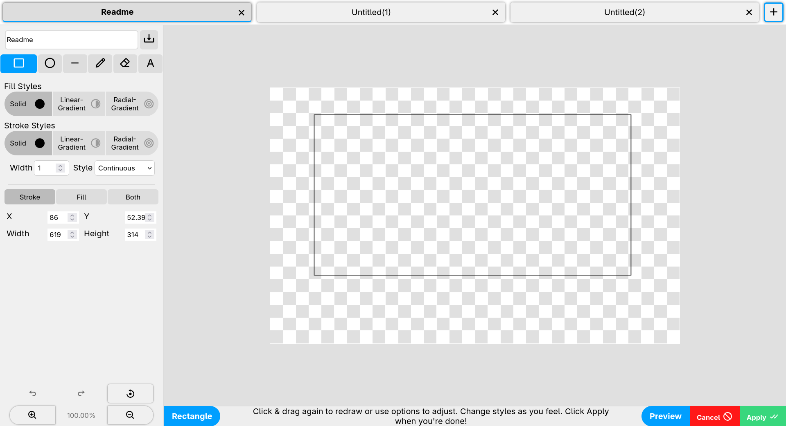
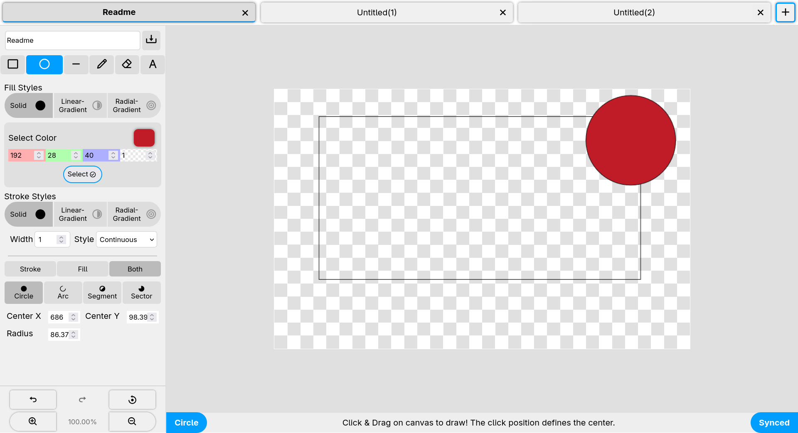
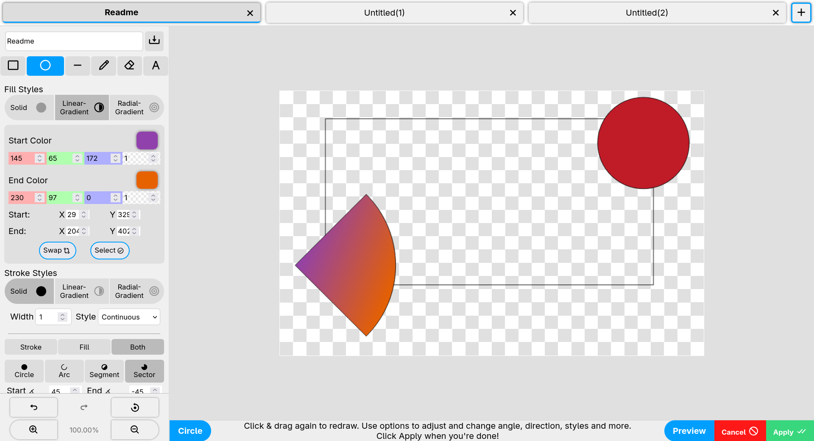
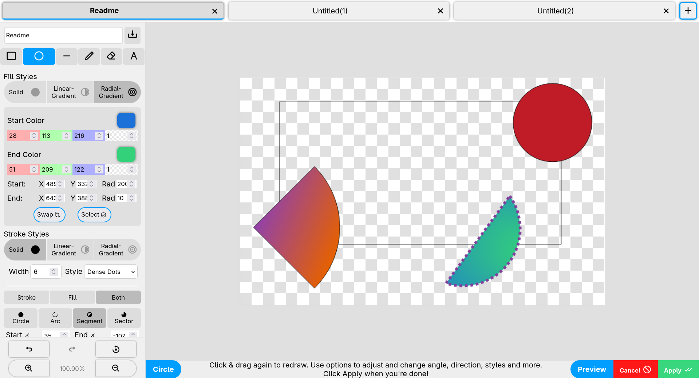
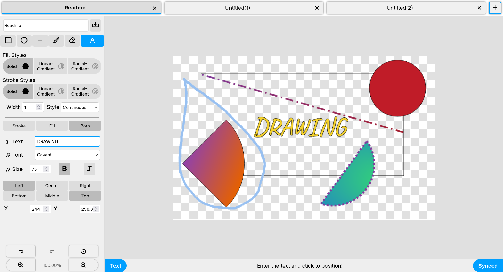
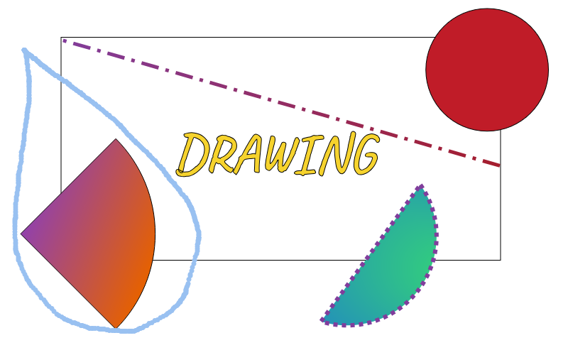

#+TITLE: Drawing: A basic paint program created as React practice
* Getting started
#+begin_src sh
npm install
npm start
#+end_src
* Features
- Draw Rectangles, Circles, Arcs, Segments, Sectors or Lines
- Or draw free-form with Pencil tool
- A Text tool and an Eraser to clean things up!
- Use solid colors, or linear and radial gradients if you fancy!
- Multi tab support
- Export to PNG
* A gallery of horrible scribbling

